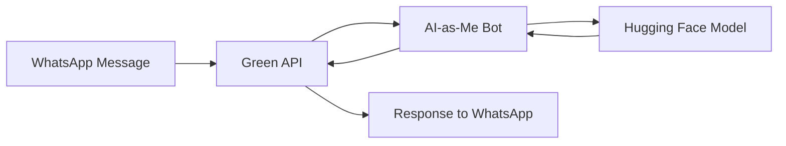

<div align="center">
  
  <h1 style="color: #25D366;">🤖 AI-as-Me WhatsApp Bot</h1>
  <p><i>A personal AI assistant that can impersonate you on WhatsApp!</i></p>

  [](https://www.python.org/downloads/)
  [](https://www.whatsapp.com)
  [](https://huggingface.co/spaces)
</div>

---

<div align="center" style="margin: 30px 0;">
  <h3 style="color: #34B7F1;">🌟 Features</h3>
</div>

- 🧠 **Smart Conversations**: Powered by a fine-tuned LLM that learns your chat style
- 📱 **WhatsApp Integration**: Seamlessly works with WhatsApp through Green API
- 🔒 **Privacy Focused**: Only responds to specified contacts
- ⚡ **Real-time**: Instant message processing and responses
- 🎯 **Targeted Responses**: Personalized AI responses based on context

---

<div align="center" style="margin: 30px 0;">
  <h3 style="color: #34B7F1;">🚀 Quick Start</h3>
</div>

1. **Clone the repository**
```bash
git clone https://github.com/subhakanta156/AI-as-Me-Whatsapp.git
cd AI-as-Me-Whatsapp
```

2. **Install dependencies**
```bash
pip install -r requirements.txt
```

3. **Configure your environment**
   - Create a Green API account at [green-api.com](https://green-api.com)
   - Update `.env` with your credentials:
```properties
WA_INSTANCE="your-instance-id"
WA_TOKEN="your-api-token"
ALLOWED_SENDER="Contact Name"
TARGET_CHAT_ID="xxxxx@c.us"
```

4. **Run the bot**
```bash
python ai_me.py
```

---

<div align="center" style="margin: 30px 0;">
  <h3 style="color: #34B7F1;">🛠️ Architecture</h3>
</div>



---

<div align="center" style="margin: 30px 0;">
  <h3 style="color: #34B7F1;">💡 Usage Examples</h3>
</div>

<div style="width: 100%; background-color: #f6f8fa; padding: 15px; border-radius: 6px;">

```python
# Send a message to your bot
"Hey, what's up?"

# Bot responds with your style
"Just working on some code, 
thinking about grabbing coffee soon! 
How about you? 😊"
```

</div>

---

<div align="center" style="margin: 30px 0;">
  <h3 style="color: #34B7F1;">🔮 Future Enhancements</h3>
</div>

- [ ] Multi-language support
- [ ] Voice message handling
- [ ] Image recognition capabilities
- [ ] Group chat support
- [ ] Advanced conversation memory

---

<div align="center" style="margin: 30px 0;">
  <h3 style="color: #34B7F1;">📜 License</h3>
  <p>MIT © 2025 Subhakanta Rath</p>
</div>

<div align="center" style="margin-top: 50px; padding: 20px; background-color: #f8f9fa; border-radius: 6px;">
  <p style="margin: 10px 0;">Made with ❤️ and ☕</p>
  <p style="font-weight: bold;">Star ⭐ this repo if you find it useful!</p>
</div>
<div align="center" style="margin: 30px 0;">
  <div class="tech-stack" style="display: flex; justify-content: center; gap: 20px; margin: 20px 0;">
    
    
    
    
  </div>
</div>
<div align="center">
    <br>
    
    <p align="center">
        
        
        
    </p>
</div>
